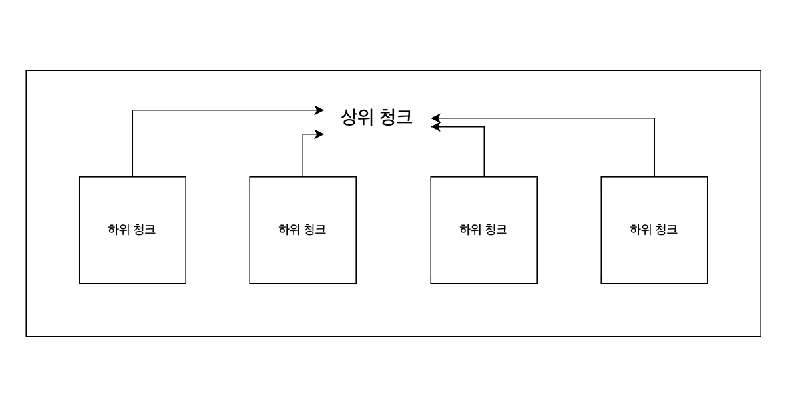

# LangChain(8) - Retriever (MultiQueryRetriever, MultiVectorRetriever, Long-Context Reorder)

Vector Store을 만들어 임베딩된 벡터들을 저장한다.

이후 사용자의 질문과 <mark>**관련된 문서**</mark>를 Vector Store에서 가져오는 것을 <mark>**Retrievel이 담당**</mark>하게 된다.

<br>

LangChain에서의 Retrievel은 Vector Store과 모듈을 <mark>**독립적으로 분리**</mark>해두어 다른Vector Store로 <mark>**교체해 실험하거나, 디버깅하기에 유용**</mark>하다.

<br>

## Retrievel 생성

LangChain에서의 Retrievel 생성하는 방법은 <mark>**통합된 인터페이스로 제공**</mark>한다.

생성된 벡터스토어에서 메서드 `as_retriever()` 를 사용하면 된다.

```python
from langchain_chroma import Chroma

vector_store = Chroma(
    collection_name="example_collection",
    embedding_function=embeddings,
    persist_directory="./chroma_langchain_db",
)

retriever = vector_store.as_retriever()
retriever.invoke("Stealing from the bank is a crime", filter={"source": "news"})
```

<br>

### 유사도 반환 함수

<mark>**질문과 문서의 유사도 점수**</mark>를 같이 출력해 특정 <mark>**유사도 점수 이상만 검색**</mark>하여 근거를 높일 수 있다.

- `similarity_search_with_score`
  값이 <mark>**낮을수록**</mark> 질문과 유사도가 높다.
- `similarity_search_with_relevance_scores`
  값이 <mark>**높을수록**</mark> 질문과 유사도가 높은것이다.

```python
results = vector_store.similarity_search_with_relevance_scores(
"Stealing from the bank is a crime"
)
```

<br>

### search_kwargs

`search_kwargs` 을 사용하면 가장 관련도 높은 <mark>**문서 k개 만큼만 출력**</mark>한다.

```python
results = vector_store.similarity_search_with_relevance_scores(
	"Stealing from the bank is a crime",
	k=2
)
```

<br>

### MMR(Maximal Marginal Relevance)

지금까지의 검색 전략은 가장 유사도 높은 순으로 k를 추출했다.

하지만 이 방법의 한계가 존재한다.

- 사용자의 질문과 가장 비슷한 청크들만 가져오면, 비슷한 정보만을 포함해 <mark>**한정적인 정보만을 바탕으로 답변**</mark>하게 된다.

<br>

그래서 다양한 청크들을 바탕으로 <mark>**풍부한 답변을 받는 검색 전략**</mark>이 MMR이다.

<br>

MMR의 검색전략은 다음과 같다.

질문과 <mark>**유사도가 가장 높은 문서 집합중**</mark>에서,

<mark>**가장 유사도 점수가 높은 문서와 유사도가 낮을수록 MMR 점수가 높다.**</mark>

`lambda_mult` 파라미터로 두 문서의 <mark>**중요도를 조절**</mark> 할 수 있다.

- `lambda_mult=1`인
  질문과 유사도가 가장 높은 문서를 검색한다.
- `lambda_mult=0`
  문서 집합 중 가장 유서한 문서와 유사도가 매우 낮게끔 문서를 검색한다.

<br>

즉, `lambda_mult` <mark>**값을 낮게 하면 다양성을 중심으로 문서를 검색**</mark>한다.

```python
retriever = vector_store.as_retriever(
    search_type="mmr",
    search_kwargs={"k": 1, "fetch_k": 2, "lambda_mult": 0},
)
retriever.invoke("Stealing from the bank is a crime")
```

<br>

## MultiQueryRetriever

사용자의 질문과 가장 유사한 문서를 찾는것이 RAG의 핵심이다.

하지만, 사용자의 <mark>**질문이 문서들과 유사하지 않은 경우 적절한 문서를 찾기가 어렵다.**</mark>

<br>

이것을 해결하는 방법이, <mark>**사용자 질문을 여러 버전**</mark>으로 만들어서 검색하는 것이다.

`MultiQueryRetriever`이 LLM을 사용해서 <mark>**사용자의 질문을 다양하게 만든다.**</mark>

```python
from langchain_classic.retrievers.multi_query import MultiQueryRetriever

multiquery_retriever = MultiQueryRetriever.from_llm(
    retriever=db.as_retriever(),
    llm=llm,
)

relevant_docs = multiquery_retriever.invoke("Stealing from the bank is a crime")
```

<br>

## MultiVectorRetriever



MultiQueryRetriever이 샤용자 질문을 재가공해서 검색 품질을 올렸다면,

MultiVectorRetriever는 <mark>**문서 벡터를 재가공**</mark>해서 검색 품질을 향상시킨다.

<br>

RAG는 청크의 길이가 답변의 품질에 매우 큰 영향을 준다.

- 너무 길면 LLM이 처리하는 <mark>**토큰 수가 늘어나 비용이 증가**</mark>하고, 정확한 근거가 많은 <mark>**텍스트에 가려질 수 있다.**</mark>
- 너무 짧으면 LLM이 얻는 정보가 너무 적어 <mark>**환각현상**</mark>을 일으킬 수 있다.

<br>

이것을 해결하는 것이 상위 문서 검색이라는 개념이다.

청크를 크게 2가지로 나눈다.

- <mark>**긴 길이의 청크 상위 청크**</mark>
- <mark>**짧은 길이의 하위 청크**</mark>

<br>

사용자 질문과 관련된 문서를 검색할때 <mark>**하위청크에서 검색해 정확도를 높이며,**</mark>

<mark>**LLM 에게 전달할때**</mark>는 하위 청크의 <mark>**상위 청크를 전달**</mark>해, 더 완전한 맥락을 주입한 답변을 만들 수 있게 된다.

```python
from langchain_classic.retrievers.multi_vector import MultiVectorRetriever
from langchain.storage import InMemoryByteStore
from langchain_text_splitters import RecursiveCharacterTextSplitter
import uuid

vectorstore = Chroma(
    collection_name="documents",
    embedding_function=embedding_model,
)

# 상위 청크를 저장
# 상위 청크 id를 '키'로 지정
# 하위 청크들도 같은 id 값을 배정
store = InMemoryByteStore()

id_key = "doc_id"

retriever = MultiVectorRetriever(
    vectorstore=vectorstore,
    byte_store=store,
    id_key=id_key,
)

# 문서 고유 id 생성
doc_ids = [str(uuid.uuid4()) for _ in docs]

# 하위 청크로 만들기위한 스플리터 생성
child_text_splitter = RecursiveCharacterTextSplitter(chunk_size=400)

# 상위 청크들을 순회하며, 하위 청크로 분할한뒤 상위 청크의 id 상속
sub_docs = []
for i, doc in enumerate(docs):
	_id = doc_ids[i]
	_sub_docs = child_text_splitter.split_documets([doc])

	for _doc in _sub_docs:
			_doc.metadata[id_key] = _id

	sub_docs.extend(_sub_docs)

# VectorStore에 하위청크 추가
retriever.vectorstore.add_documents(sub_docs)

# docstore에 상위 청크 저장할때, doc_ids 지정
retriever.docstore.mset(list(zip(doc_ids, docs)))
```

<br>

## Long-Context Reorder

LLM은 <mark>**컨텍스트가 길어질수록 정보 추출 정확도가 매우 낮아진다.**</mark>

하지만, 아무리 컨텍스트가 길어져도,

- <mark>**정보의 매우 앞쪽(0~10%)나**</mark>
- <mark>**매우 뒤쪽(90~100%)에 위치하면**</mark>
  <mark>**정확도가 거의100%와 가깝다.**</mark>

<br>

랭체인에서는 이런점을 착안해서 컨텍스트 내 문장들의 순서를 재정렬해서 RAG가 더 잘 동작하게 Long-Context Reorder 기능을 제공한다.

<br>

사용자의 질문과 관련된 문서를 여러개 추출한뒤, 중요한 순서대로 맨 앞쪽과 뒤쪽에 배치해서 답변의 정확도를 향상시키는 원리이다.

```python
from langchain_community.document_transformers import LongContextReorder

reordering = LongContextReorder()
reordered_docs = redorering.transform_documents(docs)
print(reordered_docs)
```

<br>

Reference

- https://github.com/langchain-ai/langchainjs/blob/7ea8874715f76c17d3ec3d2ff0503dd12abbc5e9/libs/langchain-classic/src/retrievers/multi_query.ts#L91
- https://wikidocs.net/234109
