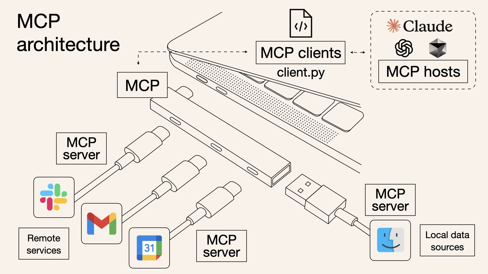
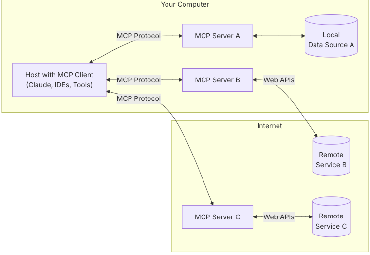

# MCP(Model Context Protocol)

**MCP(Model Context Protocol) Agent란?**

MCP는 2024년 11월 [‘앤트로픽’이 발표](https://www.anthropic.com/news/model-context-protocol)한 오픈 소스 프로토콜이다.

MCP는 AI가 도구, 데이터베이스, API와 같은 외부 리소스를 표준화된 방식으로 호출할 수 있게 하는 통신 규약이다.

이를 통해 에이전트는 단순히 텍스트를 생성하는 것을 넘어, 실제 작업을 수행하고 문제를 해결하는 능동적인 역할을 한다.

<br>

예를 들어, 이메일 전송, 데이터베이스 조회, 실시간 정보 검색과 같은 작업을 MCP를 통해 수행할 수 있다.

결론적으로 MCP는 AI 에이전트가 더 모듈화되고, 확장 가능하며, 일관성 있게 동작하도록 만드는 핵심 기술이다.



다양한 하드웨어 연결 포트 규격들이 USB-C로 통일되고 나서 어떤 기기들끼리도 호환이 된다.

MCP도 AI와 다양한 데이터 소스 및 도구들의 연결 방식을 표준화되게 통일 시켜 어떤 AI와도 호환이 가능하게 했다.

즉, 외부 앱을 MCP 형식으로 만들면 어떤 AI 에이전트(클로드, 오픈AI.. 등)에든지 바로 연결이 가능하다.

<br>

MCP를 활용해서 LLM 애플리케이션 외부 앱 연동, 확장이 쉬워짐.

MCP는 오픈 소스로 공개되어 새로운 AI용 앱을 만들 수 있다.

<br>

**MCP 원리**



- **MCP Hosts**: 클로드 데스크 탑, IDE, AI tool 같은 데이터를 접근하려는 프로그램이다.
- **MCP Clients**: MCP 서버와 1:1로 연결을 유지하며 서버에 요청한다.
- **MCP Servers**: 클라이언트 요청을 받아서 외부 앱들이 정보를 제공하거나 동작을 하는 서버.
- **Local Data Sources**: MCP 서버에서 컴퓨터의 파일, 데이터베이스에 안전하게 접근 가능한 데이터들이다.
- **Remote Services**: 외부 API 서비스들이다.

<br>

예시

**다른 규격**: 노션 새 페이지 만들기를 위해서 API 규칙 맞춰야한다. 슬랙(Slack) 메시지 전송은 슬랙의 API 규칙을 따라야 한다.

**같은 규격:** AI는 '도구 실행'이라는 표준 MCP 명령만 알면, MCP 서버가 노션, 슬랙의 세부 규칙을 알아서 처리해준다.

<br>

### MCP 적용 전 슬랙, 노션 API 호출 규격

**MCP 적용전: 노션 API 호출**

```json
{
  "parent": {
    "database_id": "YOUR_DATABASE_ID"
  },
  "properties": {
    "이름": {
      "title": [
        {
          "text": {
            "content": "API로 새 페이지 만들기"
          }
        }
      ]
    },
    "작성자": {
      "rich_text": [
        {
          "text": {
            "content": "AI 에이전트"
          }
        }
      ]
    },
    "상태": {
      "select": {
        "name": "진행중"
      }
    }
  }
}
```

<br>

**MCP 적용 전: 슬랙(Slack) API 호출 (메시지 전송)**

```json
{
  "channel": "C1234567890",
  "text": "새로운 지라 티켓이 생성되었습니다: [PROJ-123] 새로운 로그인 기능 개발"
}
```

**엔드포인트(Endpoint)**: `https://slack.com/api/chat.postMessage`

**인증(Authentication)**: `Bearer` 타입의 토큰을 헤더에 포함시켜야 한다.

**요청 본문 (Request Body in JSON)**: 슬랙(Slack)이 요구하는, 노션과는 완전히 다른 제이슨(JSON) 구조를 가진다.

<br>

### MCP 적용 후 노션, 슬랙 API 호출 규격

**MCP 적용 후: 슬랙(Slack) API 호출**

```json
{
  "tool_name": "post_slack_message",
  "inputs": {
    "channel_id": "C1234567890",
    "message_text": "새로운 지라 티켓이 생성되었습니다: [PROJ-123] 새로운 로그인 기능 개발"
  }
}
```

<br>

**MCP 적용 후: 노션 API 호출**

```json
{
  "tool_name": "create_notion_page",
  "inputs": {
    "parent_database_id": "YOUR_DATABASE_ID",
    "title": "API로 새 페이지 만들기",
    "author": "AI 에이전트",
    "status": "진행중"
  }
}
```

표준화된 JSON 형식으로 MCP 서버가 이 요청을 Slack API 형식에 맞게 변환해서 처리한다.

<br>

즉, 결론적으로 하나의 프로토콜을 표준화해서 더 빠르고 쉽게 LLM과 위부 앱들을 연동할 수 있게된다.

많은 사람들이 MCP 서버를 만들어서 공유하고 있다.

<br>

## MCP 적용 방법

작동 방식

1. MCP 서버에 연결해서 사용 가능한 도구 목록을 가져온다.
2. 사용자 질문을 받으면, 이 도구 목록과 LLM에 질문을 보낸다.
3. LLM이 도구를 사용해야겠다고 판단하면, 해당 도구를 MCP 서버를 통해 실행한다.
4. 도구 실행 결과를 다시 LLM에 보내 최종적인 자연어 답변을 생성한후, 사용자에게 보여준다.

<br>

파이썬 기반의 챗봇 클라이언트를 만들어 MCP 서버와 상호작용하는 방법이다.

<br>

가장 먼저 **환경 설정**을 해준다.

uv 같은 가상 환경를 사용해서 **mcp**, anthropic 등 파이썬 패키지를 설치한다.

```bash
uv init mcp-client # 프로젝트 디렉토리 생성
cd mcp-client # 가상환경 선택

uv venv # 가상환경 생성

source .venv/bin/activate # 가상환경 활성화

uv add mcp # mcp 설치

rm main.py # main.py 보일러 플레이트 파일 삭제

touch client.py # client.py 파일 생성
```

<br>

모델 생성

```python
import torch
import json
import asyncio
from contextlib import asynccontextmanager
from mcp import ClientSession, StdioServerParameters
from mcp.client.stdio import stdio_client
from transformers import AutoModelForCausalLM, AutoTokenizer

def load_qwen_model():
    """모델과 토크나이저를 로드"""
    print("모델 로딩 중...")
    device = "cuda" if torch.cuda.is_available() else "cpu"
    model_name = "Qwen/Qwen2.5-32B-Instruct"
    model = AutoModelForCausalLM.from_pretrained(
        model_name,
        torch_dtype=torch.bfloat16,
        device_map="auto",
        load_in_4bit=True
    )
    tokenizer = AutoTokenizer.from_pretrained(model_name)
    print("모델 로딩 완료.")
    return model, tokenizer, device
```

<br>

MCP server 연결 코드

```python
@asynccontextmanager
async def connect_to_mcp_server(server_script_path: str):
    """MCP 서버에 연결하고 세션을 생성"""
    command = "python" if server_script_path.endswith('.py') else "node"
    server_params = StdioServerParameters(command=command, args=[server_script_path])

    async with stdio_client(server_params) as stdio_transport:
        stdio, write = stdio_transport
        async with ClientSession(stdio, write) as session:
            await session.initialize()
            print("서버 연결 성공.")
            yield session
```

<br>

Query 처리 코드 및 도구 호출

```python
async def process_query_with_tools(session, model, tokenizer, device, query: str) -> str:
    """쿼리를 처리하고 필요시 도구를 호출"""

    response = await session.list_tools()
    available_tools = [{"type": "function", "function": {
        "name": tool.name, "description": tool.description, "parameters": tool.inputSchema
    }} for tool in response.tools]

    messages = [{"role": "user", "content": query}]

    while True:
        prompt = tokenizer.apply_chat_template(
            messages, tools=available_tools, add_generation_prompt=True, tokenize=False
        )
        inputs = tokenizer(prompt, return_tensors="pt").to(device)
        outputs = model.generate(**inputs, max_new_tokens=1000)
        response_text = tokenizer.decode(outputs[0][inputs.input_ids.shape[1]:], skip_special_tokens=True)

        if "<|tool_code|>" in response_text:
            messages.append({"role": "assistant", "content": response_text})

            tool_call_str = response_text.split("<|tool_code|>")[1].split("<|/tool_code|>")[0]
            tool_call = json.loads(tool_call_str)
            tool_name = tool_call.get("name")
            tool_args = tool_call.get("arguments", {})

            print(f"도구 호출: {tool_name}({tool_args})")
            result = await session.call_tool(tool_name, tool_args)
            print(f"결과: {result.content}")

            messages.append({
                "role": "tool",
                "content": json.dumps(result.content),
                "tool_call_id": "placeholder_id"
            })
            # ---------------------------
            continue
        else:
            return response_text
```

<br>

1. **모델에게 질문**

```python
outputs = model.generate(**inputs, max_new_tokens=1000)
```

`while` 루프 안에서 현재까지의 대화 내용(`messages`)과 사용 가능한 도구 목록(`available_tools`)을 모델에게 전달하며 답변을 생성

<br>

1. **도구 사용 여부 판단**

```python
if "<|tool_code|>" in response_text:
            messages.append({"role": "assistant", "content": response_text})
```

모델이 답변 대신 도구를 사용해야겠다고 판단하면, 응답 텍스트에 `<|tool_code|>` 라는 특별한 신호를 포함시킨다.

<br>

1. **도구 실행**

```python
tool_call_str = response_text.split("<|tool_code|>")[1].split("<|/tool_code|>")[0]
tool_call = json.loads(tool_call_str)
tool_name = tool_call.get("name")
tool_args = tool_call.get("arguments", {})

result = await session.call_tool(tool_name, tool_args)
```

신호가 감지되면, 코드에서 어떤 도구를 어떤 정보로 호출해야 하는지 파싱(parsing)한 뒤`session.call_tool`을 통해 실제로 도구를 실행한다.

<br>

1. **결과 피드백**

```python
if ...
		messages.append({
		    "role": "tool",
		    "content": json.dumps(result.content),
		    "tool_call_id": "placeholder_id"
		})
		continue
else:
    return response_text
```

도구 실행 결과를 다시 대화 내용(`messages`)에 추가한 후 루프의 처음으로 돌아갑니다. 모델은 방금 실행된 도구의 결과를 보고 다음 행동(또 다른 도구 호출 또는 최종 답변 생성)을 결정한다.

이 과정은 모델이 최종 답변을 내놓을 때까지 (즉, 더 이상 `<|tool_code|>`를 생성하지 않을 때까지) 반복된다.

<br>

1. 실행

```python
async def main():
    """메인 실행 함수"""
    model, tokenizer, device = load_qwen_model()

    # 실제 서버 스크립트 경로
    server_script = "path/to/your/server.py"

    async with connect_to_mcp_server(server_script) as session:
        user_query = "오늘 부천시 날씨를 알려주고, 내일 아침 8시에 알려달라고 리마인더 등록해줘"
        final_response = await process_query_with_tools(session, model, tokenizer, device, user_query)

        print("\n 최종 답변:")
        print(final_response)

if __name__ == "__main__":
    asyncio.run(main())
```

<br>

참고

- [Introducing the Model Context Protocol](https://www.anthropic.com/news/model-context-protocol)
- [Model Context Protocol Docs](https://modelcontextprotocol.io/introduction)
- [Model Context Protocol servers](https://github.com/modelcontextprotocol/servers)
- [Model Context Protocol For Client Developers Docs](https://modelcontextprotocol.io/quickstart/client)
